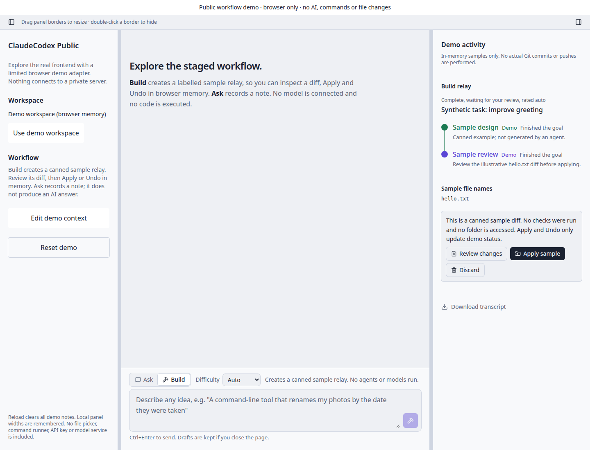

# ClaudeCodex — Limited Public Edition

Runnable source for a deliberately reduced portfolio edition. The full commercial product is a separate private project.

## Run locally

Requires Node.js 22.13 or newer.

```bash
npm ci
npm run dev
```

Open http://127.0.0.1:3412/. The development server binds only to localhost and refuses an occupied port.

```bash
npm run check
npm run build
npm run preview
```

The build creates a static `dist/` folder that can be hosted separately. Publishing this repository does not automatically host a website.

## Included

Real React frontend: resizable/collapsible side panels, sample staged task relay, diff preview, simulated Apply/Undo, notes, shared demo context and JSON transcript export.

## Source provenance

App, Chat and Relay UI are copied from the authoritative PC source. A new demo adapter implements browser-memory samples without a server.

## Limits

NO AI inference, cloud agents, file access, sandbox, command execution or Git pushes. Build creates a CANNED sample task; Apply/Undo only change its in-memory status. Reload clears the demo. The original Python backend remains private.

No private accounts, credentials, owner chat logs, customer records or PC paths are bundled. No paid service is contacted. Use synthetic inputs to evaluate the demo.

## Storage and privacy

Demo notes/tasks stay in memory. Browser local storage remembers only panel widths and the chat draft. Use a private browser session for evaluation.

## Licensing

Publication permits viewing the source; no blanket permissive licence or commercial IP transfer is granted. Third-party packages keep their licences. See `PUBLIC_SCOPE.md` and `THIRD_PARTY_NOTICES.md`.

## Demo preview



## Preparation evidence

TypeScript check and production build passed. A local browser demonstration completed without page errors. Dependency audit reported zero known advisories at preparation time (5 October 2026). No full application test suite was run. These checks do not certify production readiness.
